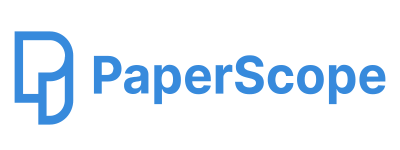
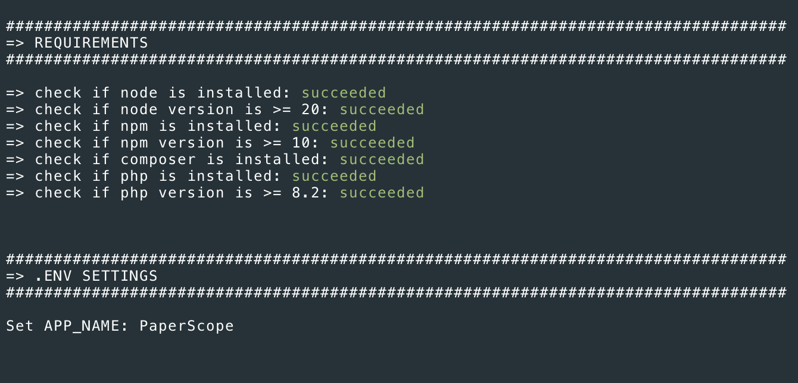
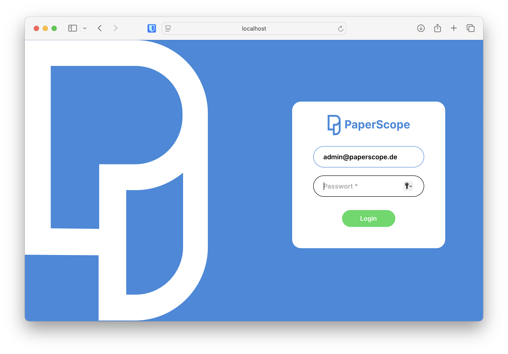
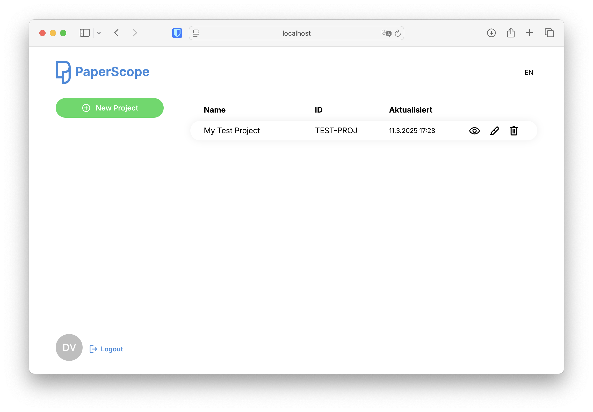
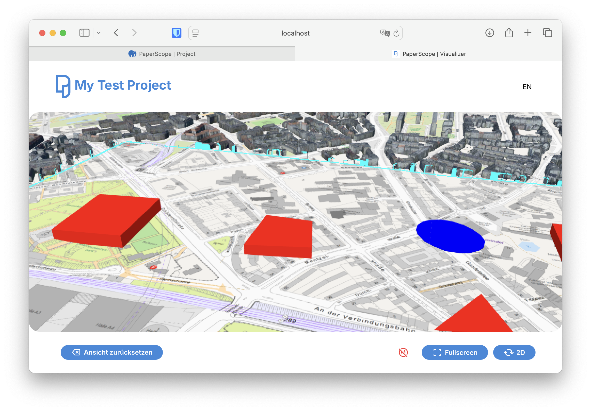
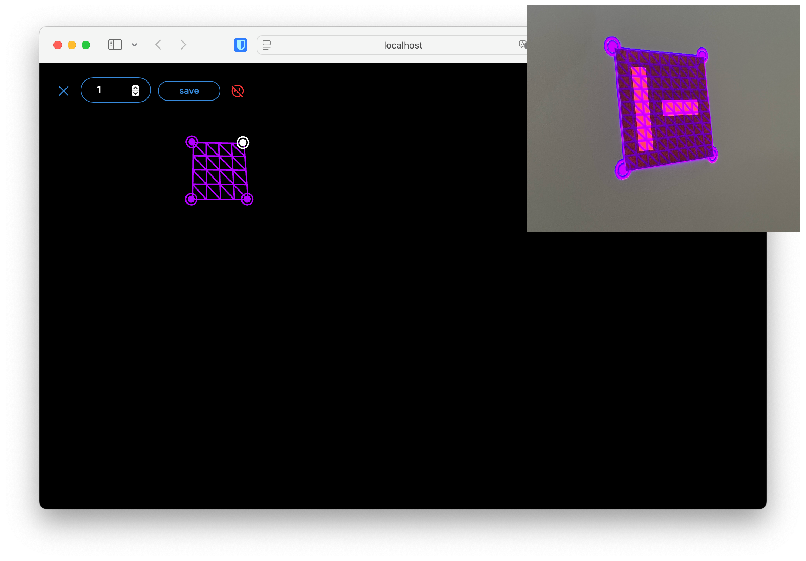
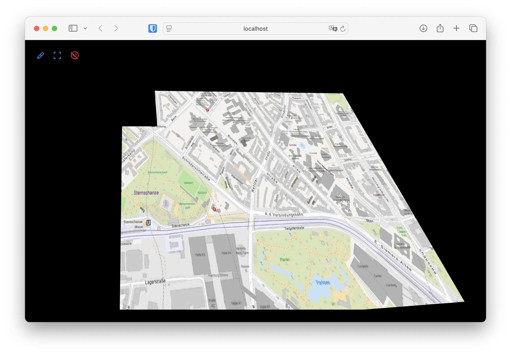

# PaperScope Website


The PaperScope Website is a comprehensive platform designed for configuring and managing projects for PaperScope. It offers a range of features to enhance your experience, including:

- **User Accounts**: Manage user profiles and access levels.
- **Visualizer**: Web based Cesium 2D/3D map for visualizing your projects in realtime.
- **Projection Mapping**: Utilize a beamer for projection mapping capabilities.

The entire implementation is based on PHP-Framework "Laravel". For implementation details visit the [Laraval documentation](https://laravel.com/docs/12.x).

To update your javascript code you need to use [Vite](https://laravel.com/docs/12.x/vite).

For local development use `npm run watch`

For production code us `npm run production`


## Prerequisites
- PHP >= 8.2 and [Composer](https://getcomposer.org/download/)
- Node >= 20 and npm.[NVM](https://github.com/nvm-sh/nvm) allows you to quickly install and use different versions of node
- Web Server (Apache or nginx)
– Databse Server (MySQL) 


## Setup

To initially set up the project, you can use the `install.sh` script via the command line. This script will guide you through the configuration process by asking for several input values. Follow these steps:

1. Open your terminal.
2. Navigate to the project directory:
    ```sh
    cd PAPERSCOPE_PROJECT_FOLDER/
    ```
3. Run the `install.sh` script:
    ```sh
    ./install.sh
    ```
4. The script will prompt you for various configuration inputs, such as database credentials, application environment settings, and other necessary parameters. Provide the required information as prompted.



Once the script completes, your project will be configured and ready to use.

Ensure that the subfolder `public/` is accessible via the previously entered `APP_URL` configuration value from your local webserver.


## How To Use

Use the root account you entered during the install script setup with `ROOT_EMAIL` and `ROOT_PASSWORD` to login.



After login you can create and manage your projects




The Visualizer displays your PaperScope scene data (tracked with the PaperScope Manager) in real-time. Please ensure that the correct project ID is set in the PaperScope Manager.

The Visualizer uses either WebSockets on TCP port 443 for event-based updates or a polling mode that checks for new data every 3 seconds.




You can use a beamer for projection mapping to display a map overlay on your physical tracking area. To calibrate, drag the purple square onto your Aruco tracking marker. If both overlays are identical, the perspective transformation of the map should match your physical tracking area. 

You can use the `[C]` key on your keyboard to toggle between calibration and view mode.


If you change the scaling to a different value, you must also update the scaling value in the PaperScope Manager.





